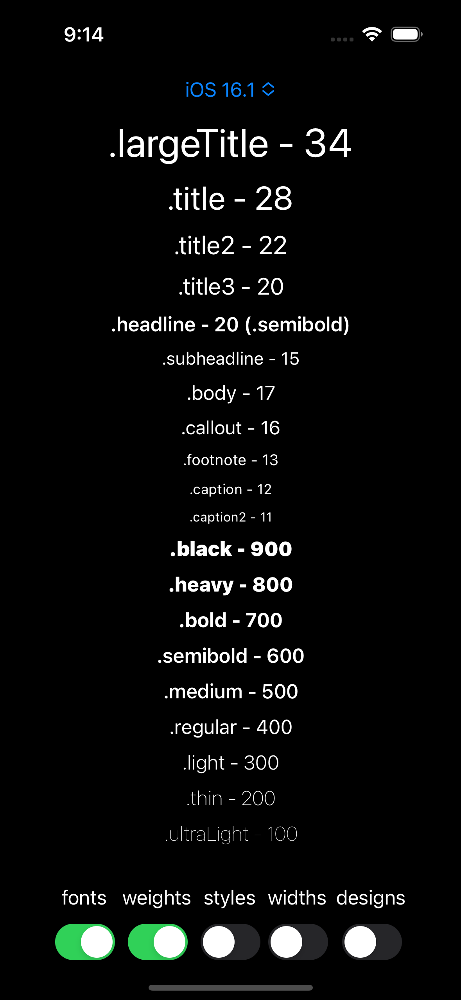
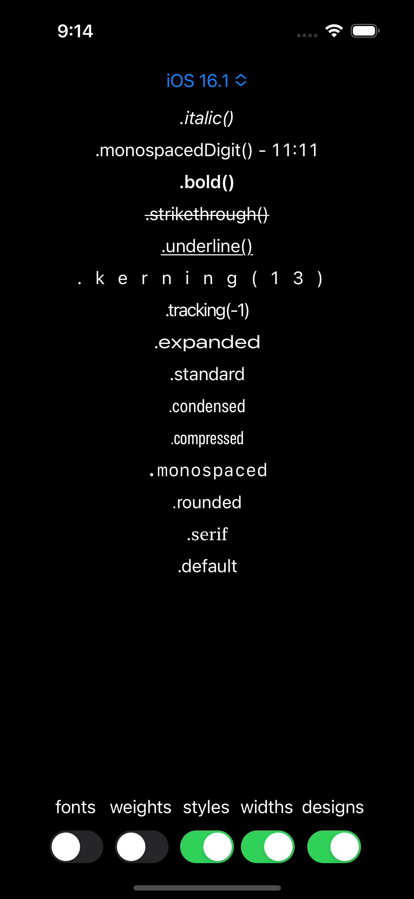
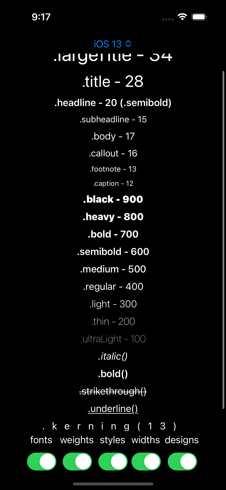

# iOS - Design - Helper

## Description

**Just a simple app to let you check:**
- what sizes (in px) have different SUI fonts
- which iOS version which modifier supports
- what are weights numbers
- how do other `Text()` modifiers work

You can install this app on a Simulator and check, when it's needed\
All configurations are saved locally

## Screenshots

    

    

    

